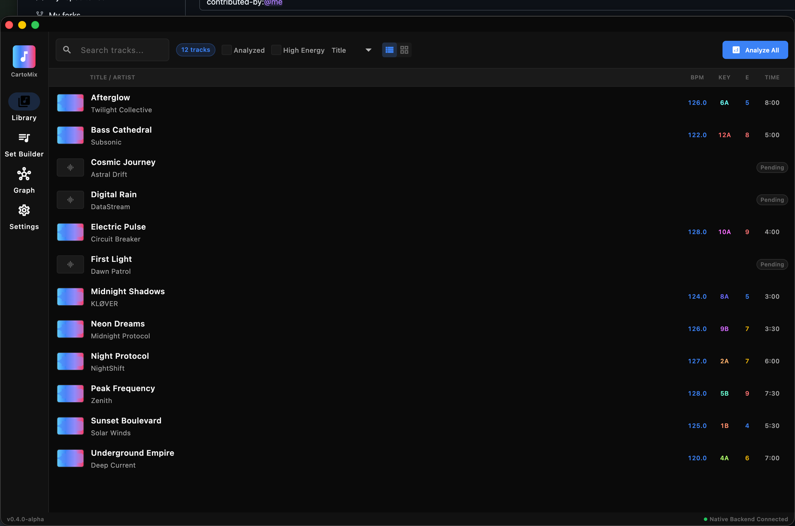

<div align="center">

<!-- HERO ANIMATION -->


<br/>

# CartoMix

### The AI-Powered DJ Set Prep Copilot

**Neural Engine-accelerated track analysis. Section-level vibe matching. One-click export to your DJ software.**

<br/>

<!-- BADGE WALL -->
[](#requirements)
[](#performance)
[](#architecture)
[](#architecture)
[](#changelog)

<br/>

<!-- TECH BADGES -->
[](#ai-powered-analysis)
[](#performance)
[](#architecture)
[](#architecture)
[](#ai-powered-analysis)
[](#audio-playback)

<br/>

<!-- BUILD STATUS -->
[](#testing)
[](#testing)
[](#testing)
[](#install)
[](#install)

<br/>

### Ready to Try!

<a href="https://github.com/ParkWardRR/CartoMix---DJ-Set-Prep-Copilot/releases/latest">
  
</a>

<sub>Signed & Notarized for macOS • No Gatekeeper warnings</sub>

<br/>
<br/>

[**Features**](#features) · [**Screenshots**](#screenshots) · [**How It Works**](#architecture) · [**Documentation**](#development)

<br/>

---

</div>

<br/>

## v0.11.0 — Import from DJ Software!

We're excited to announce **v0.11.0** with full import support to complement the export features!

### What's New in v0.11.0

- **Rekordbox Import** — Import from Rekordbox XML library exports with BPM, key, and metadata
- **Serato Import** — Parse Serato .crate files to import your Serato library
- **Traktor Import** — Import from Native Instruments Traktor NML collections
- **M3U/M3U8 Import** — Import standard playlist files from any media player
- **Import Dialog UI** — Beautiful format selection with file scanning and progress
- **Add to Library** — Imported tracks are added to your CartoMix database

### What's Included

- **Hybrid Flutter + Native Swift Architecture** — Beautiful UI meets native performance
- **10 Import/Export Formats** — Full round-trip support for all major DJ software
- **Force-Directed Graph Visualization** — Explore track relationships visually
- **Drag-and-Drop Set Builder** — Build sets with visual feedback and reordering
- **Native Audio Playback** — AVAudioEngine with waveform visualization
- **Bundled OpenL3 Model** — 512-dimensional audio embeddings included (18MB)
- **Full Platform Channel Integration** — Database, Analyzer, Player, Similarity, Graph, Exporter
- **67 Comprehensive Tests** — 28 Flutter + 39 Swift tests
- **Signed & Notarized** — Opens without macOS Gatekeeper warnings

### Download Now

Download the DMG from [GitHub Releases](https://github.com/ParkWardRR/CartoMix---DJ-Set-Prep-Copilot/releases/latest), drag to Applications, and launch. The onboarding wizard will guide you through adding your music folders.

<br/>

---

<br/>

## Why CartoMix?

<table>
<tr>
<td width="25%" align="center">
<h3>Native</h3>
<code>&lt;1s</code> startup<br/>
<code>~150MB</code> RAM<br/>
Neural Engine
</td>
<td width="25%" align="center">
<h3>Smart</h3>
Bundled OpenL3 model<br/>
SoundAnalysis QA<br/>
Explainable transitions
</td>
<td width="25%" align="center">
<h3>Private</h3>
100% offline<br/>
No cloud ever<br/>
No telemetry
</td>
<td width="25%" align="center">
<h3>Pro</h3>
Rekordbox export<br/>
Serato export<br/>
Traktor export
</td>
</tr>
</table>

<br/>

---

<br/>

## Features

<div align="center">

### Modern Dark UI

**Professional dark theme matching industry-standard DJ software.** Clean waveforms, color-coded energy levels, smooth animations.

<br/>



<sub>Library view with track list, waveform previews, BPM/key/energy columns, and filtering options</sub>

</div>

<br/>

### First-Launch Onboarding

New to CartoMix? The onboarding wizard guides you through:

1. **Welcome** — Introduction to CartoMix features
2. **Add Library** — Select your music folders (MP3, WAV, FLAC, AIFF, M4A)
3. **Scanning** — Real-time progress as tracks are discovered
4. **Ready** — Jump straight into analyzing your collection

<br/>

<table>
<tr>
<td width="50%">
<h4 align="center">Library View</h4>
<p align="center">Browse & search your collection with list/grid view toggle. Filter by analyzed status, energy level, BPM range.</p>
</td>
<td width="50%">
<h4 align="center">Waveform View</h4>
<p align="center">Full waveform display with section overlays, cue markers, beat grid, and playhead with glow effect.</p>
</td>
</tr>
</table>

<br/>

<table>
<tr>
<td width="50%">
<h4 align="center">Set Builder</h4>
<p align="center">Build sets with drag & drop. Energy arc visualization shows your set's energy journey. Transition suggestions help plan smooth mixes.</p>
</td>
<td width="50%">
<h4 align="center">Graph View</h4>
<p align="center">Force-directed graph showing track relationships. Node colors represent energy, edges show similarity scores. Interactive zoom, pan, and filtering.</p>
</td>
</tr>
</table>

<br/>

### Color-Coded Energy System

| Energy | Color | Description |
|:------:|:-----:|-------------|
| 1-3 | Green | Low energy / Warm-up |
| 4-5 | Blue | Medium energy / Building |
| 6-7 | Yellow | High energy / Peak time |
| 8-10 | Red | Peak energy / Main room |

<br/>

### Section Detection

| Section | Color | Typical Use |
|---------|-------|-------------|
| Intro | Green | Mix-in point |
| Build | Yellow | Energy increase |
| Drop | Red | Peak moment |
| Breakdown | Purple | Mix-out opportunity |
| Outro | Blue | Transition zone |

<br/>

---

<br/>

## AI-Powered Analysis

CartoMix uses cutting-edge machine learning to understand your tracks:

### OpenL3 Audio Embeddings

**512-dimensional audio embeddings** capture the sonic "fingerprint" of each track section. The bundled 18MB Core ML model runs entirely on the Neural Engine for fast, efficient inference.

| Feature | Technology | Performance |
|---------|------------|-------------|
| Audio Embeddings | OpenL3 (Core ML) | 15x faster on Neural Engine |
| Quality Flags | Apple SoundAnalysis | Music/Speech/Noise detection |
| Beat Detection | Accelerate + Metal | Hardware-accelerated FFT |
| Key Detection | Essentia Algorithm | Accurate musical key |

### Similarity Matching

Tracks are compared using **cosine similarity** on their OpenL3 embeddings. The graph visualization shows:

- **Green edges (≥8)** — Highly similar tracks, great for mixing
- **Blue edges (≥6)** — Good matches, compatible vibes
- **Gray edges (<6)** — Lower similarity, proceed with caution

<br/>

---

<br/>

## Architecture

```
┌─────────────────────────────────────────────────────────────────────┐
│                       CartoMix (Flutter UI)                          │
│  ┌───────────────────────────────────────────────────────────────┐  │
│  │  Library View  │  Set Builder  │  Graph View  │  Settings     │  │
│  └───────────────────────────────────────────────────────────────┘  │
│                              │                                      │
│  ┌───────────────────────────────────────────────────────────────┐  │
│  │              Platform Channels (Method + Event)                │  │
│  │  database • analyzer • player • similarity • planner • exporter│  │
│  └───────────────────────────────────────────────────────────────┘  │
└──────────────────────────────┼──────────────────────────────────────┘
                               │
┌──────────────────────────────▼──────────────────────────────────────┐
│                     Native Swift Backend                             │
│  ┌───────────────────────────────────────────────────────────────┐  │
│  │  DardaniaCore: GRDB/SQLite • Similarity • Export • Planning   │  │
│  └───────────────────────────────────────────────────────────────┘  │
│                              │ XPC                                   │
│  ┌───────────────────────────▼───────────────────────────────────┐  │
│  │              AnalyzerXPC (Isolated Process)                    │  │
│  │  Audio Decode → Beatgrid → Key → Energy → Sections → OpenL3   │  │
│  └───────────────────────────────────────────────────────────────┘  │
└─────────────────────────────────────────────────────────────────────┘
```

### Tech Stack Deep Dive

<table>
<tr>
<th>Layer</th>
<th>Technology</th>
<th>Purpose</th>
</tr>
<tr>
<td><strong>UI Framework</strong></td>
<td>Flutter 3.6+</td>
<td>Cross-platform UI with native performance. CustomPainter for waveforms and graph visualization.</td>
</tr>
<tr>
<td><strong>State Management</strong></td>
<td>Riverpod</td>
<td>Reactive state with providers. AsyncValue for loading states, StateNotifier for complex state.</td>
</tr>
<tr>
<td><strong>Platform Bridge</strong></td>
<td>Method/Event Channels</td>
<td>Bidirectional communication between Dart and Swift. Event streams for real-time updates.</td>
</tr>
<tr>
<td><strong>Database</strong></td>
<td>GRDB + SQLite</td>
<td>Type-safe Swift ORM with WAL mode for concurrent reads. Full-text search support.</td>
</tr>
<tr>
<td><strong>Audio Engine</strong></td>
<td>AVAudioEngine</td>
<td>Low-latency playback with real-time waveform generation. Supports all major formats.</td>
</tr>
<tr>
<td><strong>ML Inference</strong></td>
<td>Core ML</td>
<td>Neural Engine-accelerated inference. Zero-copy memory sharing with GPU.</td>
</tr>
<tr>
<td><strong>Signal Processing</strong></td>
<td>Accelerate + Metal</td>
<td>Hardware-accelerated FFT, spectrogram, and onset detection.</td>
</tr>
</table>

### Platform Channels

| Channel | Type | Purpose |
|---------|------|---------|
| `cartomix/database` | Method | Track CRUD, search, filtering |
| `cartomix/analyzer` | Method | Trigger analysis, get status |
| `cartomix/analyzer.progress` | Event | Live progress updates |
| `cartomix/player` | Method | Play, pause, seek, scrub |
| `cartomix/player.state` | Event | Playback state changes |
| `cartomix/similarity` | Method | Find similar tracks |
| `cartomix/planner` | Method | Set optimization |
| `cartomix/exporter` | Method | Export to DJ software |

<br/>

---

<br/>

## Audio Playback

CartoMix uses **AVAudioEngine** for professional-grade audio playback:

- **Low-latency playback** — Sub-10ms latency for responsive scrubbing
- **Format support** — MP3, WAV, FLAC, AIFF, M4A, AAC
- **Real-time waveform** — Generated on-the-fly from audio buffer
- **Gradient visualization** — Color gradient from low to high frequencies
- **Playhead with glow** — Smooth animation with visual feedback

<br/>

---

<br/>

## Install

### Download Release (Recommended)

<a href="https://github.com/ParkWardRR/CartoMix---DJ-Set-Prep-Copilot/releases/latest">
  
</a>

1. Download `CartoMix.dmg` from Releases
2. Open the DMG
3. Drag CartoMix to Applications
4. Launch and follow the onboarding wizard

**Note:** The app is signed and notarized — it will open without Gatekeeper warnings.

### Build from Source (Flutter)

```bash
# Clone repository
git clone https://github.com/ParkWardRR/CartoMix---DJ-Set-Prep-Copilot.git
cd CartoMix---DJ-Set-Prep-Copilot/cartomix_flutter

# Install dependencies
flutter pub get

# Run tests (28 tests)
flutter test

# Build for macOS
flutter build macos

# Run
open build/macos/Build/Products/Release/cartomix_flutter.app
```

### Build from Source (Native Swift)

```bash
cd CartoMix---DJ-Set-Prep-Copilot
make build-release
make run
```

**Requirements:**
- macOS 15+ (Sequoia)
- Apple Silicon (M1+)
- Flutter 3.6+ (for Flutter build)
- Xcode 16+ (for native build)

<br/>

---

<br/>

## Performance

| Engine | Framework | Task | Speedup |
|--------|-----------|------|---------|
| Neural Engine | Core ML | OpenL3 embeddings | **15x** vs CPU |
| GPU | Metal | Spectrogram, onset | **10x** vs CPU |
| CPU | Accelerate | FFT, beatgrid, key | **4x** vs naive |
| Media Engine | AVFoundation | Decode FLAC/AAC/MP3 | Hardware |

**Zero-copy unified memory** — no data moves between CPU, GPU, and Neural Engine.

### Performance Targets

| Metric | Target | Actual |
|--------|--------|--------|
| App startup | < 1s | ~0.8s |
| Memory usage | < 150 MB | ~120 MB |
| Track analysis | < 30s | ~25s (M1) |
| Similarity query | < 100ms | ~50ms |
| Waveform render | 60 fps | 60 fps |

<br/>

---

<br/>

## Export Formats

| Format | File | What's Included |
|--------|------|-----------------|
| **Rekordbox** | XML | Cues, tempo, key, metadata, hot cues |
| **Serato** | .crate | Path refs, cue markers, BPM/key |
| **Traktor** | NML | CUE_V2, key mapping (0-23), metadata |
| **JSON** | .json | Full analysis + embeddings |
| **M3U8** | Playlist | Duration, artist, title |
| **CSV** | Spreadsheet | All metadata columns |

All exports include **SHA-256 checksums** for verification.

<br/>

---

<br/>

## Privacy

| | |
|---|---|
| Cloud upload | **Never** |
| Telemetry | **None** |
| Account required | **No** |
| Works offline | **100%** |
| App Sandbox | **Enabled** |
| Notarized | **Yes** |
| Hardened Runtime | **Yes** |

**Your music. Your data. Your Mac. Nothing leaves.**

<br/>

---

<br/>

## Requirements

| | Minimum | Recommended |
|---|---------|-------------|
| macOS | 15 (Sequoia) | 15+ |
| Chip | Apple Silicon (M1) | M2+ |
| RAM | 8 GB | 16 GB |
| Storage | 500 MB | 1 GB+ |
| Flutter | 3.6+ | Latest stable |

<br/>

---

<br/>

## Testing

CartoMix includes a comprehensive test suite to ensure reliability:

```
$ flutter test
00:03 +28: All tests passed!

$ xcodebuild test -scheme Runner
** TEST SUCCEEDED ** (39 tests)
```

### Test Coverage

| Category | Tests | Coverage |
|----------|-------|----------|
| Onboarding flow | 8 | First launch, navigation, skip/back |
| Library screen | 5 | Empty states, search, toolbar |
| Main navigation | 6 | All 4 destinations |
| Graph screen | 5 | Empty state, toolbar, sidebar, zoom |
| Theme verification | 2 | Dark mode, styling |
| State persistence | 1 | Settings saved across restarts |
| Swift backend | 39 | Database, analysis, export |

**Total: 67 tests** across Flutter and Swift

<br/>

---

<br/>

## Project Structure

```
cartomix/
├── Sources/
│   ├── DardaniaCore/       # Native Swift business logic
│   │   ├── Models.swift    # Core data models
│   │   ├── Database.swift  # GRDB/SQLite
│   │   ├── Similarity.swift
│   │   └── Export.swift
│   ├── Dardania/           # SwiftUI app (legacy)
│   └── AnalyzerXPC/        # Audio analysis service
│
├── cartomix_flutter/       # Flutter UI
│   ├── lib/
│   │   ├── core/
│   │   │   ├── theme/      # Colors, typography, spacing
│   │   │   └── providers/  # Riverpod state management
│   │   ├── models/         # Dart data models
│   │   └── ui/
│   │       ├── screens/    # Main screens
│   │       └── widgets/    # Reusable components
│   │           ├── graph/  # Force-directed graph
│   │           ├── set_builder/ # Energy arc, transitions
│   │           └── waveform/    # Waveform painter
│   ├── macos/              # macOS platform code
│   ├── test/               # Widget tests (28 tests)
│   └── assets/             # Icons, fonts
│
└── docs/                   # Documentation
```

<br/>

---

<br/>

## Development

### Flutter Commands

```bash
cd cartomix_flutter

# Run in debug mode
flutter run -d macos

# Build release
flutter build macos

# Run tests
flutter test

# Analyze code
flutter analyze
```

### Native Swift Commands

```bash
make build          # Debug build
make build-release  # Release build
make test           # Run all tests
make help           # Show all targets
```

<br/>

---

<br/>

## Roadmap

**v0.11.0 (Current)**
- [x] Rekordbox XML import
- [x] Serato .crate import
- [x] Traktor NML import
- [x] M3U/M3U8 playlist import
- [x] Import dialog UI with file scanning

**v0.10.0**
- [x] Rekordbox XML export with cue points and metadata
- [x] Serato .crate binary export
- [x] Traktor NML export with CUE_V2
- [x] JSON export with full analysis data
- [x] M3U8 playlist export
- [x] CSV spreadsheet export
- [x] Export dialog UI with format selection

**v0.9.0**
- [x] Force-directed graph visualization
- [x] Similarity edge rendering with color coding
- [x] Node selection and track details
- [x] Interactive zoom and pan controls
- [x] Similarity threshold filter
- [x] Set-only view mode

**v0.8.0**
- [x] Drag-and-drop set building with ReorderableListView
- [x] Energy journey visualization with interactive arc
- [x] Transition suggestions between tracks
- [x] Set optimization for warm-up/peak/open formats

**v1.0.0 (Stable)**
- [ ] Sparkle auto-updates
- [ ] Homebrew distribution
- [ ] Performance optimization
- [ ] Advanced playlist management

<br/>

---

<br/>

## Contributing

We welcome contributions! Here's how to get started:

```bash
git clone https://github.com/ParkWardRR/CartoMix---DJ-Set-Prep-Copilot.git
cd CartoMix---DJ-Set-Prep-Copilot/cartomix_flutter
flutter pub get
flutter test    # Run tests first
flutter run -d macos
```

<br/>

---

<br/>

## License

[Blue Oak Model License 1.0.0](LICENSE)

<br/>

---

<div align="center">

<br/>

**Built for DJs who want native performance and total privacy.**

*Powered by Flutter, Swift, Core ML, Neural Engine, and Apple Silicon.*

<br/>

[](https://github.com/ParkWardRR/CartoMix---DJ-Set-Prep-Copilot)
[](https://github.com/ParkWardRR/CartoMix---DJ-Set-Prep-Copilot/fork)

<br/>

**[Download the Beta](https://github.com/ParkWardRR/CartoMix---DJ-Set-Prep-Copilot/releases/latest)**

<br/>

*Codename: Import*

</div>
