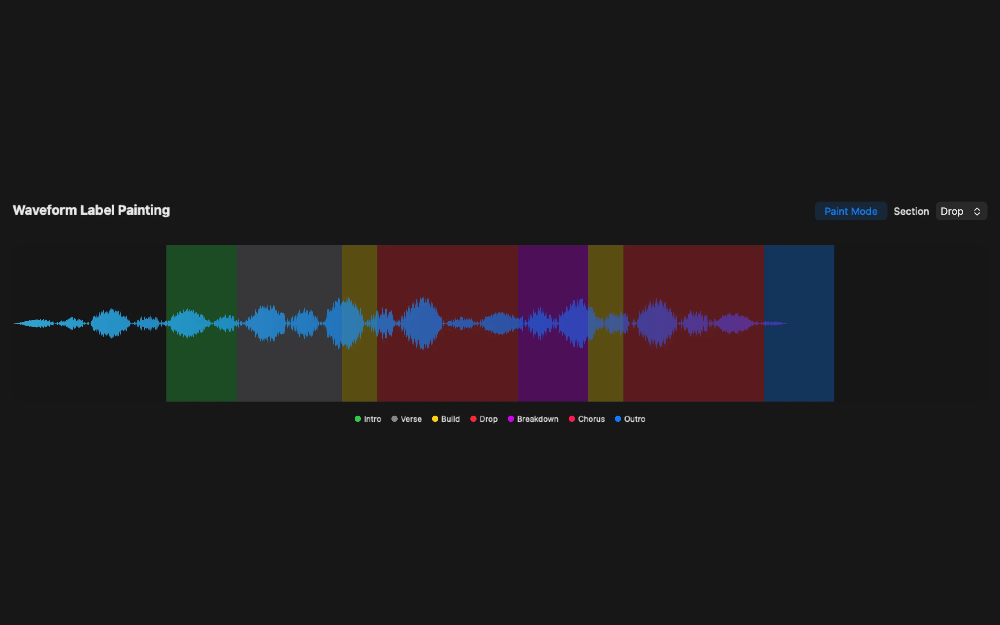
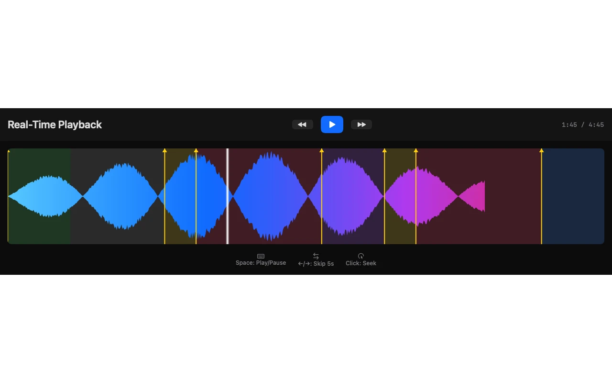
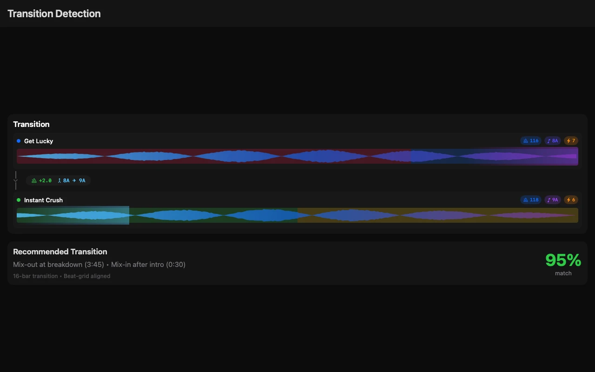
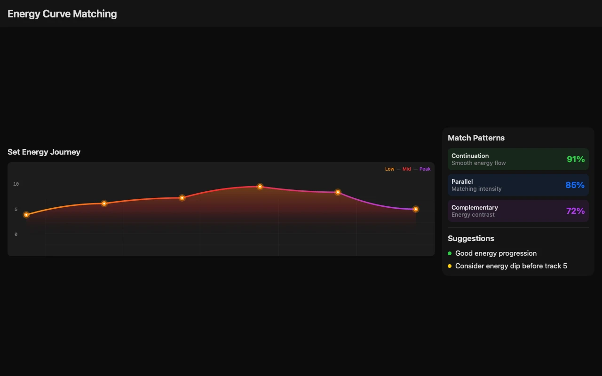
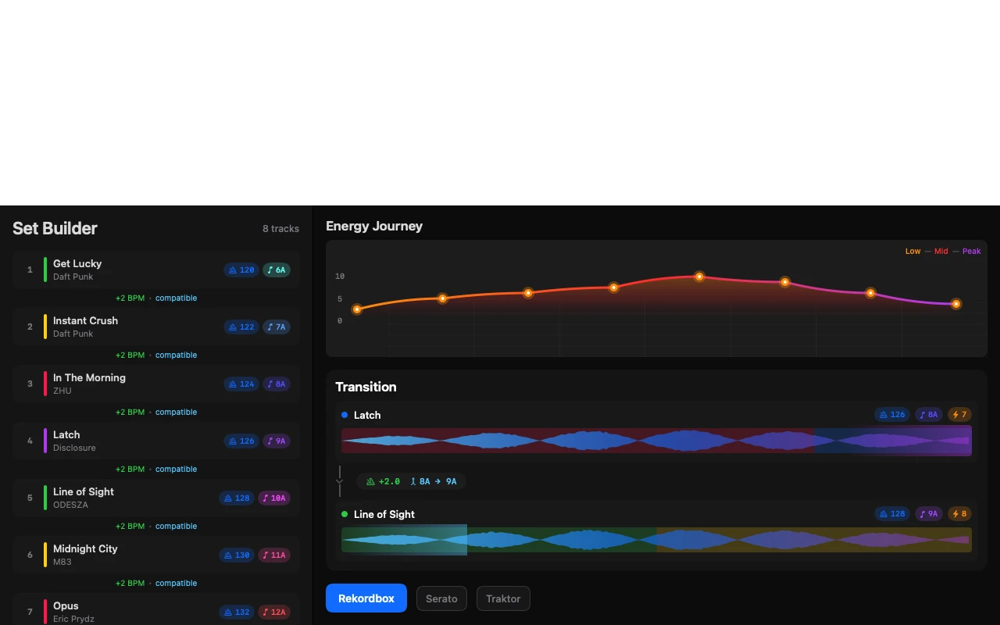
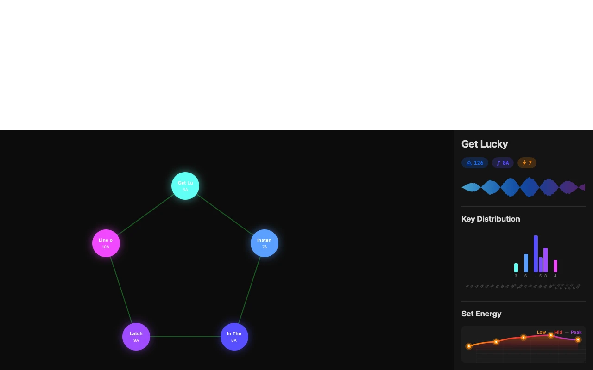
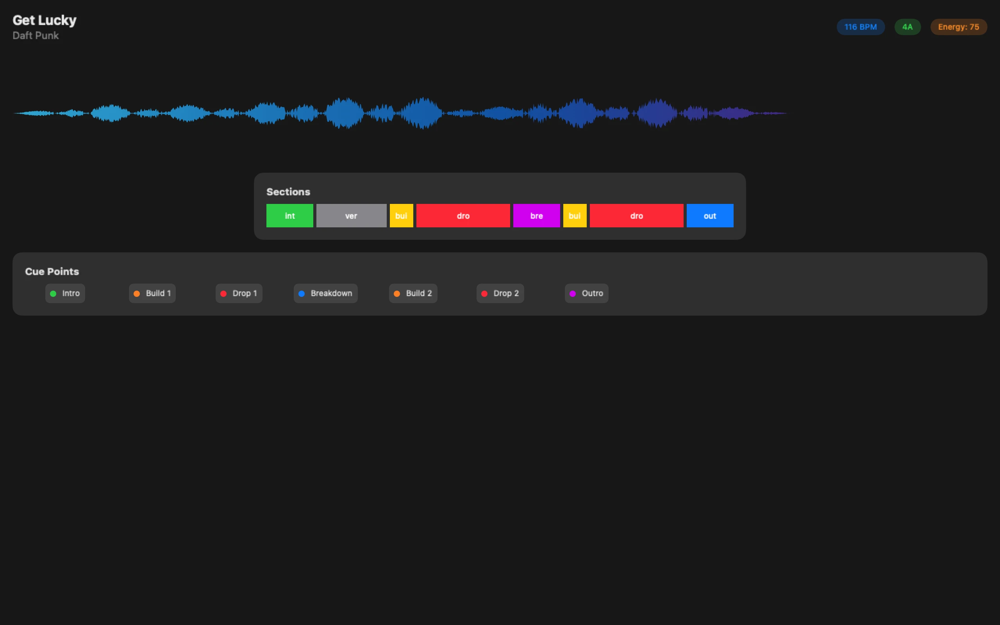
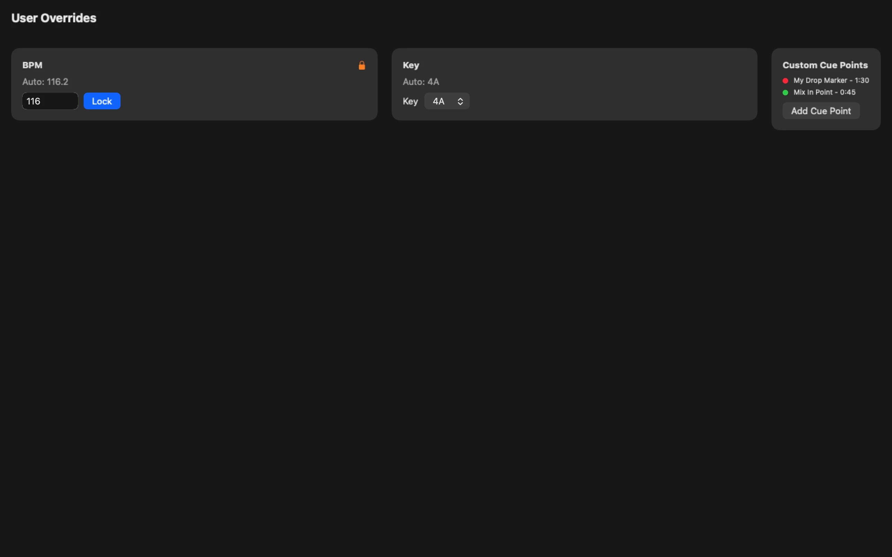
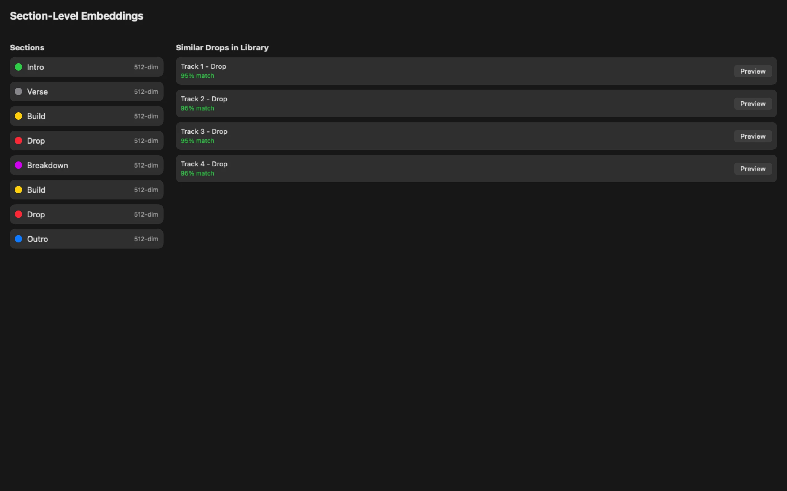

<div align="center">

<!-- HERO VIDEO - Maximum Wow Factor -->
<picture>
  <source media="(prefers-color-scheme: dark)" srcset="docs/assets/video/cartomix-hero-dark.webp">
  <source media="(prefers-color-scheme: light)" srcset="docs/assets/video/cartomix-hero-light.webp">
  
</picture>

<br/>

# CartoMix

### Your AI-Powered DJ Set Prep Copilot

**Build perfect sets with ML-powered track analysis, vibe matching, and seamless export to Rekordbox, Serato, and Traktor.**

*100% Native. 100% Local. 100% Private.*

<br/>

<!-- Core Identity Badges -->
[](#requirements)
[](#apple-silicon)
[](#architecture)
[](#changelog)

<!-- Architecture Badges -->
[](#architecture)
[](#xpc-architecture)
[](#ml-powered-similarity)
[](#apple-silicon)

<!-- ML & Features Badges -->
[](#ml-powered-similarity)
[](#ml-powered-similarity)
[](#ml-powered-similarity)

<!-- Export Badges -->
[](#export-formats)
[](#export-formats)
[](#export-formats)

<!-- Privacy & Security Badges -->
[](#privacy)
[](#privacy)
[](#privacy)
[](#distribution)

<br/>

*Codename: Dardania*

---

</div>

> ⚠️ **Important:** This is a **native macOS application** built from the ground up in Swift/SwiftUI. It is **NOT compatible** with the web-based prototype at [cartomix-Web-Based-DJ-Copilot](https://github.com/ParkWardRR/cartomix-Web-Based-DJ-Copilot). Libraries, playlists, analysis data, and settings **cannot be migrated** between the two versions. This native app offers superior performance and privacy but requires starting fresh.

---

## What Makes CartoMix Different?

<table>
<tr>
<td width="50%">

### Native Performance
- **<1 second** startup time
- **~150 MB** memory footprint
- **Zero Electron bloat**
- Native ARM optimization

</td>
<td width="50%">

### AI-Powered Analysis
- **OpenL3** deep audio embeddings
- **Section-level** similarity matching
- **Transition detection** for optimal mix points
- Neural Engine acceleration

</td>
</tr>
<tr>
<td>

### Interactive Waveform
- **Paint sections** directly on waveform
- **Real-time playback** with cue preview
- **User overrides** for BPM, key, cues
- **Energy curves** for transition planning

</td>
<td>

### Privacy First
- **100% offline** capable
- **No cloud** upload ever
- **No telemetry**
- Sandboxed with minimal entitlements

</td>
</tr>
</table>

---

## New in v0.3.0

<table>
<tr>
<td width="33%">

### Waveform Label Painting
Paint section labels directly on the interactive waveform. Drag to create intros, drops, breakdowns, and more.

</td>
<td width="33%">

### Real-Time Playback
Preview tracks with synchronized waveform. Jump to cue points, scrub through sections, keyboard shortcuts.

</td>
<td width="33%">

### Transition Detection
AI-powered detection of optimal mix-in/out points. Phrase boundary awareness, energy-based recommendations.

</td>
</tr>
<tr>
<td>

### Section Embeddings
512-dim OpenL3 embeddings for each section, not just the full track. Find tracks with similar intros or drops.

</td>
<td>

### Energy Curve Matching
Find tracks with compatible energy progressions. Parallel, complementary, or continuation matches.

</td>
<td>

### User Overrides
Edit BPM, key, cue points. Lock values to prevent re-analysis. Your edits are preserved forever.

</td>
</tr>
</table>

---

## Screenshots

<div align="center">

| Waveform Label Painting | Real-Time Playback |
|:---:|:---:|
|  |  |

| Transition Detection | Energy Curve Matching |
|:---:|:---:|
|  |  |

</div>

<details>
<summary><strong>More Screenshots</strong></summary>

| Library View | Set Builder |
|:---:|:---:|
|  |  |

| Graph View | Track Analysis |
|:---:|:---:|
|  |  |

| User Overrides | Section Embeddings |
|:---:|:---:|
|  |  |

</details>

---

## Quick Start

### Install from Release

```bash
# Download latest release
open https://github.com/ParkWardRR/CartoMix---DJ-Set-Prep-Copilot/releases

# Or via Homebrew (coming soon)
# brew install --cask cartomix
```

### Build from Source

```bash
git clone https://github.com/ParkWardRR/CartoMix---DJ-Set-Prep-Copilot.git
cd CartoMix---DJ-Set-Prep-Copilot
swift build -c release
make run
```

> Requires macOS 15+, Swift 6+, and Xcode 16+ for tests.

---

## How It Works

### 1. Import Your Library

Add folders from your local drives, NAS, or USB. CartoMix uses security-scoped bookmarks to remember access across launches.

### 2. Analyze Tracks

The XPC analyzer service runs in isolation, using:
- **Neural Engine** for OpenL3 embeddings (512-dim vibe vectors)
- **Accelerate/vDSP** for beat and key detection
- **Core ML** for section classification

### 3. Find Similar Tracks

```
Combined Score = 0.50 × OpenL3 Similarity    (vibe match)
              + 0.20 × Tempo Similarity      (BPM compatibility)
              + 0.20 × Key Similarity        (harmonic compatibility)
              + 0.10 × Energy Similarity     (energy level match)
```

Every suggestion includes a human-readable explanation:
> *"similar vibe (82%); Δ+2 BPM; key: 8A→9A (compatible); energy +1"*

### 4. Build Your Set

Drag tracks into your set, reorder with drag-and-drop, and visualize connections in Graph View.

### 5. Export

One click to Rekordbox, Serato, or Traktor format—with cue points, tempo, and key data intact.

---

## Architecture

```
┌─────────────────────────────────────────────────────────────────────────────┐
│                           CartoMix.app (SwiftUI)                            │
├─────────────────────────────────────────────────────────────────────────────┤
│  ┌────────────────────────────────────────────────────────────────────────┐ │
│  │                         UI Layer (SwiftUI)                             │ │
│  │  • LibraryView • SetBuilderView • GraphView • TrainingView             │ │
│  │  • @Observable state • Native menus & shortcuts                        │ │
│  └────────────────────────────────────────────────────────────────────────┘ │
│                                    │                                        │
│                                    ▼                                        │
│  ┌────────────────────────────────────────────────────────────────────────┐ │
│  │                       DardaniaCore (Swift)                             │ │
│  │  • GRDB/SQLite WAL • Similarity (vDSP) • Planner • Exporters           │ │
│  └────────────────────────────────────────────────────────────────────────┘ │
│                                   XPC                                       │
└───────────────────────────────────┼─────────────────────────────────────────┘
                                    │
                                    ▼
┌─────────────────────────────────────────────────────────────────────────────┐
│                        AnalyzerXPC.xpc (Isolated)                           │
├─────────────────────────────────────────────────────────────────────────────┤
│  • Audio decode (AVFoundation)     • Beatgrid (Accelerate/vDSP)            │
│  • Key detection (Krumhansl)       • Energy analysis (EBU R128)            │
│  • OpenL3 embeddings (Core ML)     • Section detection                     │
│  • SoundAnalysis (300+ labels)     • Cue point generation                  │
└─────────────────────────────────────────────────────────────────────────────┘
```

### Why XPC?

| Benefit | Description |
|---------|-------------|
| **Crash isolation** | Analyzer crash? Auto-restart. UI never freezes. |
| **Memory isolation** | Heavy analysis doesn't affect UI smoothness |
| **Security** | Minimal attack surface, sandboxed processes |
| **Launchd** | System manages lifecycle, exponential backoff |

---

## Apple Silicon Optimization

| Engine | Framework | Use Case | Speedup |
|--------|-----------|----------|---------|
| **Neural Engine** | Core ML | OpenL3 embeddings | 15x vs CPU |
| **GPU** | Metal | Spectrogram, onset detection | 10x vs CPU |
| **CPU** | Accelerate | FFT, beatgrid, key detection | 4x vs naive |
| **Media Engine** | AVFoundation | FLAC/AAC/MP3 decode | Hardware |

### Zero-Copy Unified Memory

```
Audio → Media Engine → Float32 PCM ─┬─► Accelerate (FFT)
                                    │
                                    ├─► Core ML/ANE (OpenL3)
                                    │
                                    └─► 512-dim embedding

        (No copies between CPU ↔ GPU ↔ Neural Engine)
```

---

## Export Formats

| Format | File Type | Features |
|--------|-----------|----------|
| **Rekordbox** | DJ_PLAYLISTS XML | Cues, tempo, key, metadata |
| **Serato** | .crate + cues.csv | Path refs, supplementary cues |
| **Traktor** | NML v19 | CUE_V2, key (0-23 mapping) |
| **JSON** | Structured | Full analysis + embeddings |
| **M3U8** | Playlist | Duration, artist, title |
| **CSV** | Spreadsheet | All metadata columns |

All exports include **SHA-256 checksums** for verification.

---

## Privacy & Security

| Feature | Status |
|---------|--------|
| Cloud upload | **Never** |
| Telemetry | **None** |
| Account required | **No** |
| Works offline | **Yes** |
| App Sandbox | **Enabled** |
| Notarized | **Yes** |
| Hardened Runtime | **Yes** |

Your music. Your data. Your Mac. Nothing leaves.

---

## Requirements

| Requirement | Minimum | Recommended |
|-------------|---------|-------------|
| macOS | 15 (Sequoia) | 15+ |
| Chip | Apple Silicon (M1) | M2+ |
| RAM | 8 GB | 16 GB |
| Storage | 500 MB | 1 GB+ |

---

## Migration from Web Prototype

This native macOS application is a **complete rewrite** and shares no code or data formats with the [web-based prototype](https://github.com/ParkWardRR/cartomix-Web-Based-DJ-Copilot).

| Feature | Web Prototype | Native App (This Repo) |
|---------|---------------|------------------------|
| Platform | Browser-based | macOS native |
| Performance | JavaScript | Swift/Apple Silicon |
| Privacy | Cloud-dependent | 100% local |
| ML Engine | Limited | Neural Engine |
| Data format | Web storage | SQLite + Core Data |

**What this means:**
- ❌ Libraries cannot be imported from the web prototype
- ❌ Playlists and sets are not transferable
- ❌ Analysis data must be regenerated
- ✅ Start fresh with better performance and privacy

---

## Testing

```bash
# Run all tests
make test

# Individual test suites
make test-core      # Similarity, planner, database
make test-golden    # Export format verification
make test-xpc       # Crash isolation, timeouts
```

See [docs/demo/TEST_SUITE.md](docs/demo/TEST_SUITE.md) for reproducible test procedures.

---

## Roadmap

### v0.3.0-alpha (Current)
- [x] SwiftUI-first UI
- [x] XPC analyzer service
- [x] GRDB with WAL mode
- [x] Security-scoped bookmarks
- [x] Rekordbox/Serato/Traktor export
- [x] OpenL3 similarity search
- [x] **Waveform label painting**
- [x] **Real-time audio playback**
- [x] **User override layer**
- [x] **Section-level embeddings**
- [x] **Transition window detection**
- [x] **Energy curve matching**

### v0.4.0 (Next)
- [ ] Beatgrid editing
- [ ] Loop region markers
- [ ] Harmonic mixing wheel
- [ ] Set flow visualization

### v1.0.0 (Stable)
- [ ] Sparkle auto-updates
- [ ] Complete test coverage
- [ ] Performance optimization
- [ ] Homebrew distribution

---

## Contributing

```bash
# Setup
git clone https://github.com/ParkWardRR/CartoMix---DJ-Set-Prep-Copilot.git
cd CartoMix---DJ-Set-Prep-Copilot

# Build & test
make build
make test

# Format code
make format
```

See [docs/demo/DEMO_PROCEDURES.md](docs/demo/DEMO_PROCEDURES.md) for demo recording guidelines.

---

## License

[Blue Oak Model License 1.0.0](LICENSE)

---

<div align="center">

**Built for DJs who want native performance and total privacy.**

*Powered by SwiftUI, Core ML, Neural Engine, and Apple Silicon.*

<br/>

[](https://github.com/ParkWardRR/CartoMix---DJ-Set-Prep-Copilot)
[](https://github.com/ParkWardRR/CartoMix---DJ-Set-Prep-Copilot/fork)

</div>
